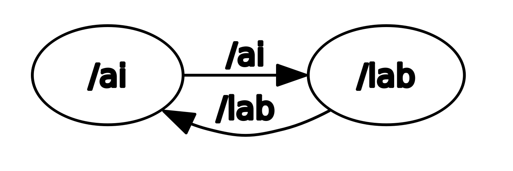
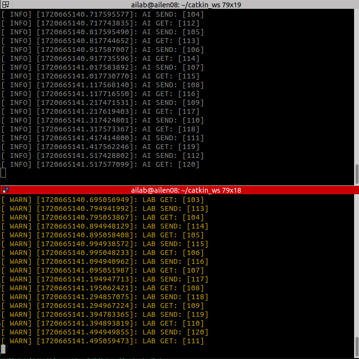
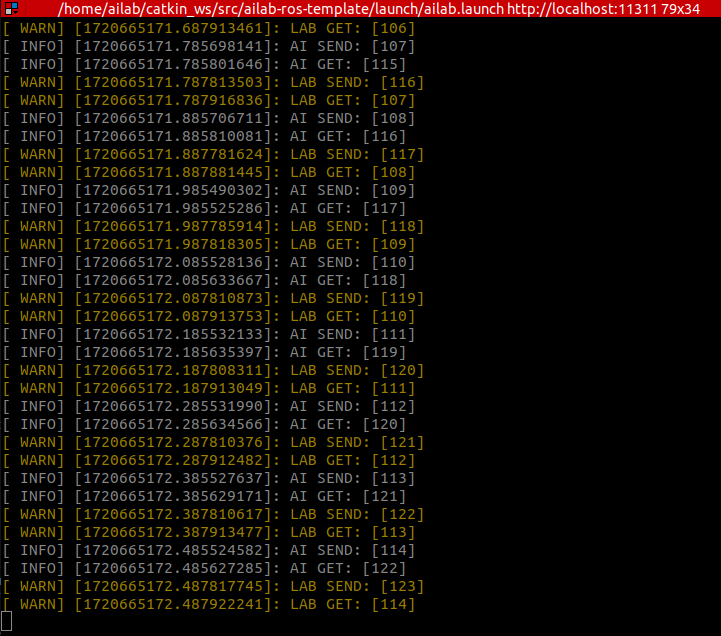

# ailab-ros-template
ailab ros template for beginner

## Pre-requirement

- ROS Noetic & Ubuntu 20.04 LTS

## Structure of Package
```bash
ailab-ros-template/
├── include/
│ ├── ai.hpp
│ └── lab.hpp
├── src/
│ ├── ai.cpp
│ └── lab.cpp
├── CMakeLists.txt
├── package.xml
└── README.md 
```
## Install

```bash
# Create workspace 
mkdir -p ~/catkin_ws/src
cd ~/catkin_ws/src
# Git clone in src
git clone https://github.com/ailab-konkuk/ailab-ros-template.git
# Build and Source bash
cd ..
catkin_make
source devel/setup.bash
```
## Execution
### Using rosrun (3 terminal is needed)
```bash
roscore
rosrun ailab_ros_template ai
rosrun ailab_ros_template lab
```
### Using roslaunch (in 1 terminal)
```bash
roslaunch ailab_ros_template ailab.launch
```
## Code Description
### rqt_graph


### Description
- ai Node

In node [ai], publish topic [ai], type is [std_msgs::Uint16].
For each node iteration, the topic [ai] value increases by 1 starting from 0 and publishes that value.

- lab Node

In node [lab], publish topic [lab], type is [std_msgs::Uint16].
For each time subscribed topic [ai] (in callback), do basic arithmetic operations (plus, minus, multiply, divide) (Define in[lab.cpp]). 
With ros parameter in launch file [lab/calculation_method], [lab/calculation_number], do some calculation and publish [lab] topic. 

$(ai.data) (+,-,*,/) (lab/calculation_number)$

### Code execution
- rosrun



- roslaunch

